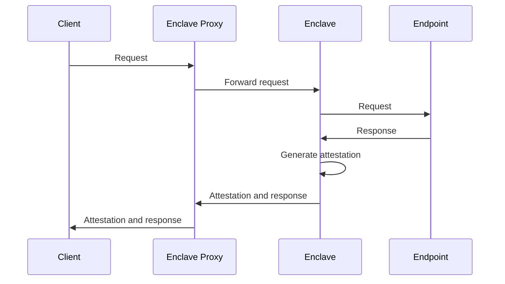
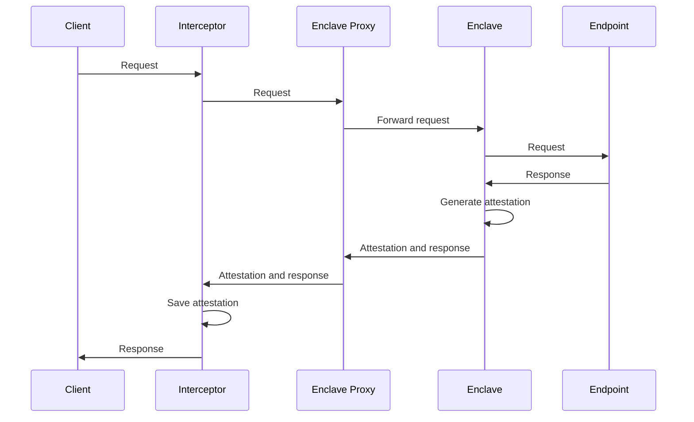
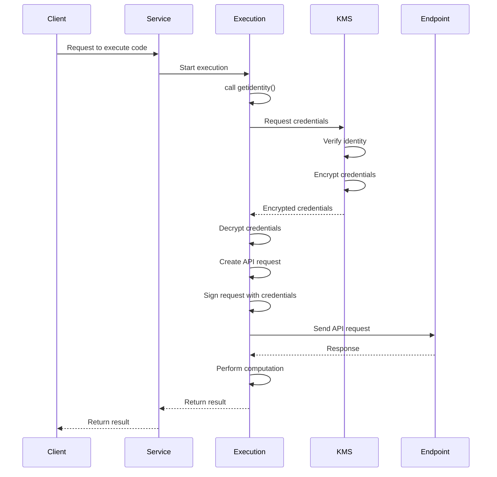

# User documentation

## Status

Crude work in progress.


## Summary

"teTLS" started as a project to provide attested HTTPS requests and
responses.  The "te" stands for "trusted execution [environment]", so
"teTLS" is similar to "zkTLS" in that both seek to provide verifiable
TLS communication. However, teTLS currently only provides attested
HTTPS request and responses, not generic TLS sessions.

In the spirit of experimentation, the current teTLS implemenation has
outgrown its name.  The service also can produce attested
cryptographically strong random bytes.  It can also attestably execute
Javascript (as strange as that might sound).  This Javascript
implemenation is executed by a WASM engine, so it would be easy to
execute arbitrary WASM, too.  Javascript (and any WASM) has full
access to HTTP requests as well as to those random bytes.  The goal is
simple facility for doing pure computation as glue around HTTP
requests and random numbers.

The combination of attested HTTP requests, random bytes, and
arbitrary Javascript execution (that make those HTTP requests and get
those random bytes) is a very capable system for a wide range of
tasks that require some verification.

Some [documentation](api.md) is available.  See some examples
[here](../examples).

Here's a quick demo.  To run this example yourself, you'd need an API
key (`$TEO_AUTH`), which you probably don't have.

```Shell
curl -s -H "X-TEO-Authorization: $TEO_AUTH" \
     -X POST https://api.tetls.net/tlsp \
     -d '{
        "url": "https://postman-echo.com/time/now",
        "method": "GET",
        "headers": {
          "Content-Type": "application/json"
        }}' |
    tee test.json |
    jq -r .parsed_response_body.body

cat test.json | jq . 
```

Output:

```
Mon, 21 Jul 2025 11:07:03 GMT
```

```json
{
  "attestation": "hEShATgioFkRIb9pbW9kdWxlX2lkeCdpLTBhZmMzZTA2NmU3MTcwYTI5LWVu [and 5932 more bytes]",
  "data": {
    "request": "eyJ1cmwiOiJodHRwczovL3Bvc3RtYW4tZWNoby5jb20vdGltZS9ub3ciLCJt [and 80 more bytes]",
    "request_headers": "eC10ZW8tYXV0aG9yaXphdGlvbjpITUFDLVNIQS0yNTYtMWQ2NzNlMjY0YzJk [and 236 more bytes]",
    "response": "eyJzdGF0dXMiOjIwMCwic3RhdHVzX2xpbmUiOiJIVFRQLzEuMSAyMDAgT0si [and 488 more bytes]",
    "response_headers": "Q29ubmVjdGlvbjpjbG9zZQ0KQ29udGVudC1MZW5ndGg6MjkNCkNvbnRlbnQt [and 328 more bytes]",
    "response_status_line": "SFRUUC8xLjEgMjAwIE9L"
  },
  "hash": "c8ef5aba07d64ee8361af5cff67c08100c317a7970fed70a0878f29be40a [and 4 more bytes]",
  "parsed_response_body": {
    "body": "Mon, 21 Jul 2025 11:07:03 GMT",
    "headers": {
      "Connection": "close",
      "Content-Length": "29",
      "Content-Type": "text/html; charset=utf-8",
      "Date": "Mon, 21 Jul 2025 11:07:03 GMT",
      "ETag": "W/\"1d-0LmParvu8AuW/MPi3LJPA2AqjoM\"",
      "Server": "nginx",
      "set-cookie": "sails.sid=s%3Ahmlcd6KRmgqDPHCG3TBrPOpWzfEZNERj.N%2BUIONfEsI1 [and 50 more bytes]"
    },
    "status": 200,
    "status_line": "HTTP/1.1 200 OK"
  }
}
```

## Attestations

The attestations the client receives are (currently) AWS Nitro enclave
attestations.  See [this
documentation](https://aws.amazon.com/blogs/compute/validating-attestation-documents-produced-by-aws-nitro-enclaves/)
for checking those attestations.


## Attested HTTP

teTLS originates TLS sessions in a trust execution environment.  That
TLS session is not terminated by any intermediary.  In the current
implementation, a proxy in front of the TEE _does_ terminate the TLS
session for the request by the client. Here's the interaction:



The client receives the endpoint's HTTPS response along with an
attestation for the request, response, and TEE execution itself.

## Attested random bytes

The TEE has access to cryptographical strong random bytes, and the
service simply exposes this capability.

## Attested Javascript execution

As described above, The Javascript engine has access to HTTP(S)
requests and random numbers.  These APIs are provided at the WASM
level -- currently via an abuse of the WASI API, which needs a serious
tidying.  Almost no WASI is actually available, but APIs are stubbed
to facilitate compilation.  The Javascript implemenation is a good
demonstration.

## Proxying

Sometimes it's convenient to proxy this service so that the ultimate
clients do not have to deal with extracting the endpoint's response
from the payload also has the attestation.  That's easy enough to
do. There are several options, including running an external MITM
proxy that writes attestations off to the side or making a in-process
intercepting proxy.



## Example interaction

The interactions can be much more elaborate when doing JavaScript
execution.  Here's an abstract example that uses `getidentity` to
obtain credentials from a KMS in order to submit a request to another
endpoint.



This approach could be use to make a secure, attested AWS API request
(using the convenience functions `addawssign` and `xmltojson`).
